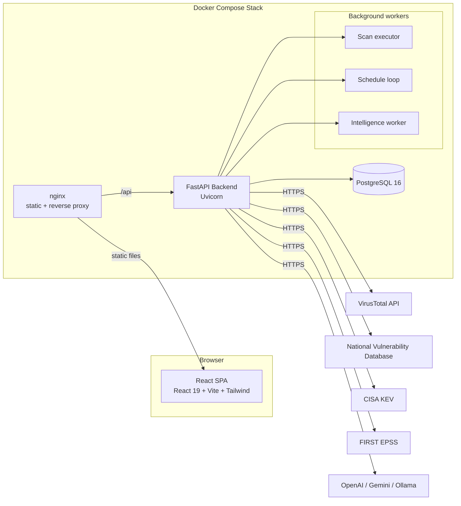

# GuardianX Architecture

GuardianX is a containerized, AI-assisted cyber asset, vulnerability, and attack
surface management platform. The system is split into a React single-page
application, a FastAPI backend, and a PostgreSQL database, orchestrated with
Docker Compose.

## High-level diagram



## Backend layout

```
backend/
├── app/
│   ├── api/v1/          # HTTP routes (auth, users, assets, scans, ...)
│   ├── core/            # config, security, JWT, roles, exceptions
│   ├── database/        # SQLAlchemy base, session, models registry
│   ├── models/          # ORM models
│   ├── schemas/         # Pydantic request/response models
│   ├── services/        # business logic
│   ├── scanners/        # nmap execution layer
│   ├── detection/       # phishing analyzers
│   ├── integrations/    # threat intel, virustotal
│   ├── intelligence/    # threat intelligence platform
│   ├── tasks/           # background workers (scan, schedule, intel)
│   ├── middleware/      # rate limit, security headers, request logging
│   ├── ws/              # websocket event hub
│   └── main.py          # FastAPI app factory
├── alembic/             # database migrations
└── tests/               # backend test suite (unittest)
```

## Frontend layout

```
guardianx-frontend/
├── src/
│   ├── pages/           # route-level views
│   ├── components/      # feature components (+ tests)
│   ├── hooks/           # React Query hooks
│   ├── services/        # API clients (axios)
│   ├── context/         # Auth, Toast providers
│   ├── shared/          # layout, storage, design system
│   ├── routes/          # router
│   ├── types/           # TypeScript types
│   └── test/            # vitest setup
└── vite.config.ts
```

## Request flow

1. A user signs in via `/auth/login`; the backend returns a JWT access token
   and a hashed refresh token.
2. The SPA stores both in `localStorage` and attaches `Authorization: Bearer …`
   on every subsequent request (see `services/api.ts`).
3. On a `401`, the axios interceptor transparently rotates the refresh token
   and retries the request once. If rotation fails, the user is redirected to
   login.
4. Background workers (scan/schedule/intelligence) run in-process via FastAPI
   lifespan and stream progress over the `/ws` endpoints.

## Security model

- Passwords hashed with **Argon2** (via `pwdlib` recommended profiles).
- Access tokens are short-lived JWTs (`HS256`) with `iss`/`aud` validation.
- Refresh tokens are stored **hashed** (SHA-256) and rotated on every use.
- Verification and password-reset tokens are random, one-time, expiring, and
  stored only as hashes.
- Cleanup happens on password change and reset (all sessions revoked).
- Roles enforce authorization: reports and user administration are role-gated.
- Out-of-the-box: security headers, request logging, and in-memory rate limiting.

## Data stores

| Component | Technology | Purpose |
|-----------|-----------|---------|
| PostgreSQL | version 16 | Primary relational store via SQLAlchemy + Alembic |
| In-memory | app process | Rate limit buckets, intel cache, scan result broadcast |

## Cross-cutting concerns

- **Observability:** structured JSON logging, `X-Request-ID`, `/health` endpoint.
- **Fallbacks:** AI provider auto-selection and graceful degradation to
  rule-based answers; threat-intel sources fall back when unreachable.
- **BYOAPI:** VirusTotal uses per-user keys encrypted at rest, never a shared
  server key.